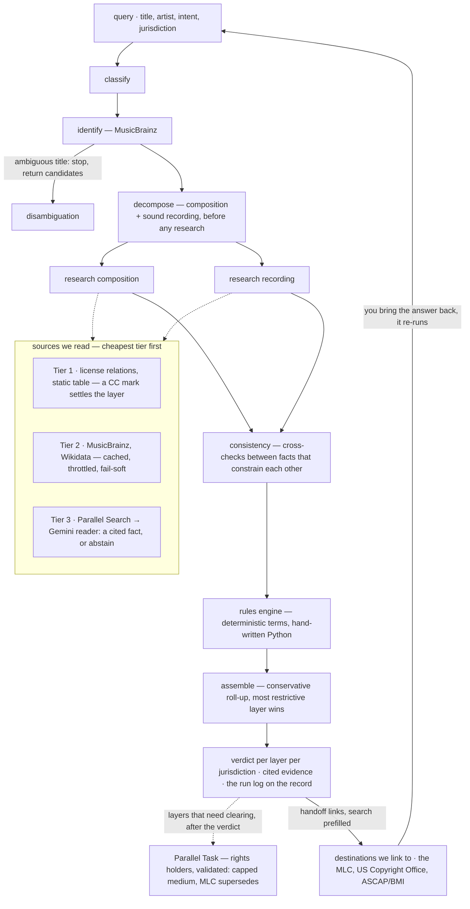

# Can I Use This?

A rights-determination agent for documentary and independent film production. Paste a music cue, say what you're making, and get a cited verdict: whether you can use it, who owns it, roughly what it would cost, and an honest account of what could not be determined. Built for the person clearing music for a cut, not for a lawyer — though the record it produces is what you'd hand one.

**Live:** https://can-i-use-this-ztkzpmtyqq-uc.a.run.app

Built for the Agentic Cinema hackathon on Devpost, Parallel track.

> Research, not legal advice. Where the public record is wrong, this is wrong. Have a professional confirm before you rely on it.

## The one idea

One thing you search for is usually several separately-owned works with different answers.

```
"West End Blues" — Louis Armstrong (1928)

              US                                UK / EU
  composition       public domain since 2024      protected until 2036
  sound recording   protected until 2029          public domain since 1979
                    ─────────────────────         ─────────────────────
  roll-up           LICENSE REQUIRED              LICENSE REQUIRED
```

Same song, and both jurisdictions say no — but blocked on *different layers*. In the US the composition is free and the master is not; in the UK and EU the master expired decades ago and the composition runs until 2036, because life+70 follows the last surviving co-writer (Clarence Williams, d. 1965). Most tools flatten this into one answer and get it wrong. Handling it correctly is the entire product.

The verdict is three-dimensional — `f(layer, jurisdiction, intent)`. The table shows the first two; the third changes which layers need clearing at all: a re-recording needs only the composition, so the same search gives a different answer when the master stops mattering. Duration is deliberately not a fourth dimension. It scales what a license costs, never whether permission is needed.

The layer model is not specific to music: a book is a work, an edition, and sometimes a translation, each with its own term and owners. The register is scoped to music because cues are the clearance problem filmmakers hit most, and because the music sources are strong enough to support a cited answer. Nothing in the architecture is music-only.

## Architecture



The stages run as a **Google ADK agent graph** (`agent/workflow.py`) — sequential agents wrapping plain-Python stage functions, with the two research stages fanned out in parallel. The graph's one model call is the reading step, Gemini 2.5 Flash on Vertex AI. The graph reproduces the pipeline's frozen acceptance fixtures exactly; the pipeline stays canonical and testable without an agent runtime.

Parallel's two endpoints do different jobs. **Search** gathers evidence on the primary request path, where latency is the budget and the reader decides what a passage actually establishes. **Task** runs structured rights-holder research after the verdict is on screen, where per-field citations matter more than speed; the answer never waits for it.

**Identify stops on ambiguity.** A title with no artist and many artists in the results returns candidates instead of researching — researching an ambiguous entity produces confidently wrong output, the worst failure mode this product has.

**Recording selection ignores `first-release-date`.** One composition is often several MusicBrainz work entities; a single work search enumerates every linked recording and picks the artist's earliest *dated session*. MusicBrainz's first-release-date is the earliest release on file — frequently a CD reissue decades after the session — and is never allowed to drive a term.

## Sources we read, destinations we link to

The distinction is the architecture. If a fact on a record ever cited one of the destinations as read, that would be a bug.

**Sources we read** — queried at runtime, cheapest tier first; every fact on a record cites one of these:

| Tier | Source | What we take |
|---|---|---|
| 1 | License URIs | Creative Commons license relations on the MusicBrainz recording, its work, or its releases, matched against a static table (`rules/licenses.py`). A license on the recording or work settles the layer and research stops; a release-level license settles it only when every release on file carries one, because a single licensed release is usually a compilation and does not license the master generally. CC0 is clear, attribution licenses are cleared with conditions, and NC does not cover a commercial use. |
| 2 | MusicBrainz | Recordings, works, writer credits, dated performances. Cached persistently, throttled, fails soft into Tier 3. |
| 2 | Wikidata | Publication dates, writer death years, writer-list corroboration. |
| 3 | Parallel **Search**, read by Gemini | Web evidence for what no API holds: renewal records, original release dates, writer corroboration. On the primary request path — every query it runs is entered in the on-screen ledger. |
| 3 | Parallel **Task**, validated | Rights-holder research after the verdict: publisher, administrator, shares, territory, one-stop status, each field cited through `output.basis`. Runs only for layers that need clearing. Capped at medium because it is research, not registry data; found shares that fall short of 100% conclude nothing about unclaimed shares; the MLC record supersedes it if access arrives. |

**Destinations we link to** — never queried, because the answers live there and there is no API access. Records link to them with the search already filled in:

- **The MLC** — publishers, administrators, ownership splits, unclaimed shares. API access requested and pending; until then every record links to the MLC's public search, and the Clearance section shows the path to the parties rather than computed splits.
- **US Copyright Office** — renewal records. Filings from 1978 on sit in an online catalog closed to web search; earlier ones are scanned catalog pages. Open questions hand over the exact search terms and name the catalog that holds the record.
- **ASCAP / BMI repertories** — writer and publisher credits, for finding who to license from.

## Where the models are, and aren't

**Gemini 2.5 Flash (Vertex AI) is used in exactly one place:** the reading step. Parallel Search gathers candidate passages; the reader turns a passage into a cited fact or abstains. Its output schema makes an unsourced fact unrepresentable, and its confidence is capped by the class of source it cites — primary record → high, rightsholder notice → medium, anything else → low — enforced in a validator, not the prompt. A "not renewed" finding needs a primary record.

**No model ever computes a copyright term.** Copyright terms are arithmetic with known answers — the 95-year term, the renewal window, the MMA/CLASSICS schedule, life+70 from the last surviving author — and a model computing them would be unverifiable. The rules engine (`rules/`) is hand-written, deterministic, unit-tested Python; every determination records which rule fired and why, so a verdict can be audited line by line.

## Confidence, and its asymmetry

Every fact is a `ResearchedFact` with sources and a confidence, or it becomes an `UnresolvedQuestion`. There is no third option.

- **high** — multiple independent authoritative sources agree, or an official record states the fact outright
- **medium** — a single authoritative source, or a rightsholder's own notice ("© 1934, renewed 1961")
- **low** — inference, or secondary sources only
- **none** — asserted by no source; nothing is concluded from it

The asymmetry: **a low-confidence fact may support "protected" but never "public domain."** A wrong "protected" costs a license that wasn't needed; a wrong "public domain" ends in a takedown or a lawsuit. When the rule that fired says public domain and the weakest supporting fact is low, the layer stays undetermined and the evidence is shown as a lead on the open question.

Open questions can be answered. When you settle one — a renewal record found in the Copyright Office catalog, say — the record takes the answer and re-runs. A bare yes/no is an opinion (low); an answer with an attestation (an RE number and date, or what was searched and where) is a finding (medium — the ceiling for anything user-supplied; high is reserved for records the register retrieved and read itself). The fact is marked *asserted by you* wherever it appears.

## Why the provenance rules exist

Five times, a source returned a plausible fact that had never actually been established, and each would have become a confident wrong verdict with no visible tell:

- **A reissue date read as a publication date.** MusicBrainz's `first-release-date` for the 1928 Armstrong *West End Blues* session was 1975 — a 47-year error on the one input the CLASSICS calculation depends on.
- **An incomplete author list silently shortening a term.** MusicBrainz credited *West End Blues* to King Oliver but not Clarence Williams, and life+70 runs from the last surviving author. Oliver died 1938, Williams 1965 — a 27-year error in the direction that gets someone sued.
- **A name search returning the wrong person.** "Clarence Williams" on Wikidata returned the actor who died in 2021, not the songwriter who died in 1965, and nothing about the result looked wrong.
- **A writer dead before the stated publication.** Kurt Weill died in 1950; the record for *Mack the Knife* stated a 1954 US publication. The usual cause is a translation or arrangement carrying its own authors, so the derivative check blocks life+70 rather than computing it from the wrong deaths.
- **A recording predating its own composition.** Garland's *Over the Rainbow* session is dated October 1938; Wikidata carries 1939, the film's release, as the composition's publication. Each date is defensible alone. The pair is impossible.

All five are the same failure: a plausible answer built on a fact that was never actually established, because each fact was checked only against its own source. That is why every fact carries sources and confidence, or isn't treated as a fact. The first ones became rules — a recording's date must come from a trustworthy basis; a writer list must be corroborated before life+70 is applied, and an uncorroborated list *blocks* the determination rather than shading it; people are resolved through identifier links first, with a name-search fallback that announces itself on the record. The fifth became the generalization: a **consistency layer** (`pipeline/consistency.py`), its own stage between research and rules, cross-checking every pair of facts that constrain each other — and the rights-holder facts Task adds, where shares summing past 100% or a publisher founded after the work are the same shape. A conflict degrades confidence and opens a question naming the honest readings, instead of silently trusting one side. When a rule can't be met the layer is undetermined and the response names the fact that would settle it.

## Setup and run

```bash
pip install -r requirements.txt

python -m pipeline "West End Blues" "Louis Armstrong"           # the CLI, no keys needed for cached/Tier 2 paths
python -m pipeline "Take Five" --json                           # no artist → stops with candidates
python -m pipeline "Blue Moon" "Ella Fitzgerald" --read         # with the Gemini reader (GCP project + ADC)
python -m pipeline "West End Blues" "Louis Armstrong" --graph   # through the google-adk graph

python -m pytest                                # rules, sources, research, registry, pipeline, agent, api
python -m sources.warm "Blue Moon" "The Marcels"  # pre-warm the cache, print timings

python -m uvicorn api.main:app --reload         # the API: /api/health · POST /api/query · SSE stream
cd web && npm install && npm run dev            # the frontend; /api proxies to the uvicorn above
deploy/deploy.sh                                # Cloud Run, re-runnable; the checklist is in the script
```

| Environment variable | Purpose |
|---|---|
| `PARALLEL_API_KEY` | Tier 3 research through the `parallel-web` SDK. Without it Tier 3 degrades: questions are still emitted, just without search evidence. On Cloud Run it comes from Secret Manager. |
| `GOOGLE_CLOUD_PROJECT` / `GOOGLE_CLOUD_LOCATION` | Vertex AI (the Gemini reading step, via `google-adk`) and Firestore. The reader is credential-gated: without them every Tier 3 question stays open. |
| `CIUT_READER` | `off` forces the NullReader even with credentials — the pipeline without the model. |
| `CACHE_BACKEND` | `sqlite` (default, `.cache/tier2.sqlite`), `firestore`, or `memory` |

Runtime AI is limited to Google Cloud AI services and Parallel; everything else is ordinary open infrastructure (httpx, Pydantic, SQLite, FastAPI, React).

## Status

- **The full flow is live**: Entry → streamed research (an accession log — every source consulted entered as it returns, failures struck through, corrected never erased) → the verdict record with layer ledger, cited evidence trail, open questions with answer controls, clearance paths and handoff links → disambiguation with candidates dated by performance relation, not reissue release dates. The run log stays on every completed record, so a warm query is legible after the fact.
- **Tier 1 runs.** A CC license relation on the recording, the work, or unanimously across releases settles the layer statically; a minority release mark is disclosed as an open question instead. Both shapes are pinned in the acceptance world.
- **The consistency layer runs** between research and rules. *Over the Rainbow* is its acceptance case: the 1938 session against the stated 1939 publication, both dates degraded, the question naming the honest readings.
- **Rights-holder enrichment runs** through Parallel Task for layers that need clearing, after the verdict: parties, roles, shares and territories with a citation per field, capped at medium, unclaimed shares never inferred from a shortfall. Live it returned OKeh and Sony Music Entertainment for the 1928 *West End Blues* master. Clearance also drafts copyable sync and master-use requests filled from the record, with the production-specific parts as marked blanks.
- **Answer and re-run**: the renewal question takes Renewed / Not renewed with an optional source attestation, and the verdict updates under the confidence policy above. Not answering is the third state; the question just stays open.
- **Cue sheet mode** (`/cues`): paste a list, one verdict row per cue, most restrictive first, with the blocking reason per row. **Export**: CSV, Markdown to clipboard, and a PDF rendered from the export template as a research memo, not a screen print.
- **Nine distribution contexts** in the UI (documentary its own value, with festival-versus-broadcast bands), split from the usage choice that changes which layers need clearing: a re-recording drops the master, print licenses through the composition only. A duration control scales the cost bands and exists to correct a misconception: US copyright has no short-use exception, so length changes the price, not the need.
- **Permalinks ask before spending a run.** A fresh record auto-opens; a stale or unresearched link lands on a Resume screen that says when it was researched and what a re-run costs.
- Both reference queries produce the expected cited two-layer verdict, warm in under a second; a cold run with Tier 3 renewal research lands at 30–40 seconds. On the first live run the reader resolved one of four renewal windows (Blue Moon, medium, from a publisher's notice) and declined the other three; it has never concluded a work free without the primary record that finding requires.
- 200+ tests across the rules engine, license table, cache layer, Parallel wrappers, holder validator, link registry, pipeline, consistency checks, reader schema, graph and API. The ADK graph reproduces the pipeline's frozen acceptance fixtures exactly.
- Not yet built: MLC integration (access pending; Task enrichment stands in, and says so). Text/film shares the skeleton and was cut for the submission — see `docs/ENDGAME.md`.

## Known limits

- **The 1931–1963 renewal window.** US works from those years lost protection after 28 years unless renewed, and most of the 20th-century songbook falls inside it. Renewals filed before 1978 exist only as scanned catalog pages; renewals filed from 1978 on are in the Copyright Office's online catalog, which web search excerpts cannot reach. The tool reads the records it can, and otherwise hands over exact search terms and the right catalog — and now takes the answer back. It does not guess. Expect many mid-century compositions to come back *undetermined*.
- **No database publishes sync licensing contacts or prices.** Sync is negotiated one-off. The tool identifies the parties and the shape of the negotiation, and gives cost bands as ranges, never a point estimate. The ranges are rough orders of magnitude from trade practice, not quotes.
- **US-centric.** The US rules are the most complete; UK and EU cover the composition (life+70) and the recording (70 years from publication). Other territories are not modelled.
- **MLC access pending.** Ownership splits and unclaimed shares — the data that decides whether a work can be fully cleared at all — live in the MLC's database. Until API access arrives, records link to its public search.
- **Music only.** The register handles music; other kinds of work are not covered, and the schema reserves the shape for them.

## Repository

```
rules/       deterministic copyright terms + boundary tests
sources/     Tier 2 clients, persistent cache, fail-soft HTTP
research/    Tier 3 — Parallel Search and Task wrappers
registry/    handoff link templates (sources.yaml)
pipeline/    the plain-Python pipeline, user-answer handling, CLI
agent/       google-adk graph, the Gemini reader, frozen acceptance fixtures
api/         FastAPI + SSE on Cloud Run
web/         React frontend — one continuous ruled document
spike/       the verification spike whose findings became the provenance rules
docs/        project definition, compliance notes, design system
schemas.py   canonical Pydantic models — the layer model lives here
```

## License

MIT — see `LICENSE`.
